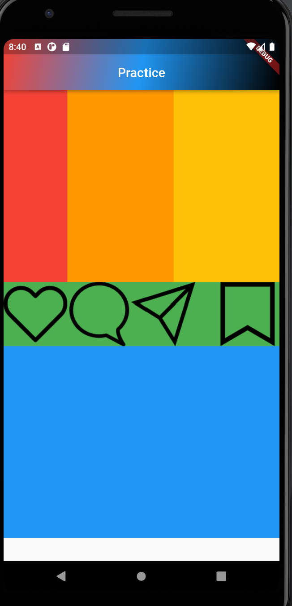
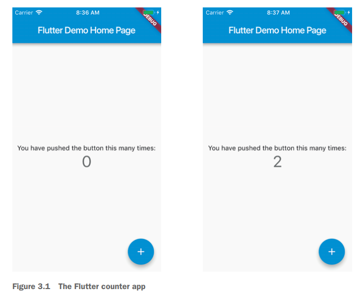
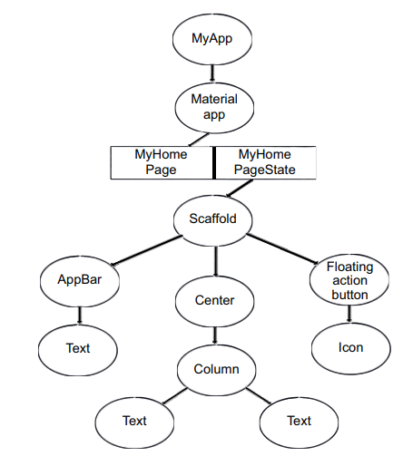

# Breakin into Flutter

---
> 이번 챕터에서는 Flutter의 내부와 외부를 소개할 예정이다. Flutter를 어떻게 사용하고 내부에서 어떻게 작동하는지 보여주고 기초를 다지는 것이 목표다.
그에 대한 계획은 다음과 같다


1. CLI로 새로운 **Flutter 프로젝트를 시작할 때 생성되는 앱인 카운터 앱**을 심도 있게 살펴봅니다.
2. 몇 가지 **기본 위젯을 추가**하여 카운터 앱을 더욱 강력하게 만듭니다.
3. **BuildContext, 위젯 트리, 그리고 엘리먼트**에 대해 이야기하는 시간을 보냅니다. 이것이 어떻게 **작동하는지 이해하는 것은** Flutter 오류 디버깅의 90%입니다.
4. Flutter 팀이 **SDK에 빌트인한 트릭과 도구**를 배웁니다. 이것은 개발을 즐겁게 만듭니다.

- Increment 앱을 통한 Flutter 기초 분석
- Flutter 위젯 클래스
- BuildContext, 위젯트리, 엘리먼트 트리
- Flutter 개발 환경 및 팁

---

### 3.1 Intro to the counter app
- 새로운 프로젝트 시작: 터미널에서 파일을 생성할 위치로 이동 후 **flutter create** 명령어 



- 이 사진은 Flutter 파일을 처음 실행하면 기본으로 나오는 카운터 앱이다. 버튼을 누르면 카운터가 증가할 것이다. 많은 기능을 가지고 있지 않지만, Flutter를 쉽게 시작할 수 있다는 장점이 있다.


---

### 3.1.1 Flutter project structure
> 프로젝트를 생성하면 많은 파일들이 생성된다. 다행히 현재까지는 많이 중요하지는 않지만 디렉터리 구조는 다음과 같아야 한다.

**counter_app**
- **android**: 컴파일된 안드로이드 앱
- **ios**: ios 앱
- **lib**:Flutter는 하나의 코드 베이스로 **iOS**와 **Android**앱을 동시에 개발이 가능하다. 여가서 하나의 코드베이스를 저장하는 폴더가 **lib** 폴더이다.
    - **main.dart**: 프로젝트의 진입점, main() 함수를 반드시 포함, 이 파일을 기준으로 앱을 빌드하고 실행한다.
- **test**: Dart를 사용해 작성한 Flutter 앱을 테스트하기 위한 코드를 저장하는 폴더이다.
    - **widget_test.dart**

- **.gitignore**

- **pubspec.yaml**: Flutter 프로젝트의 **메타 데이터를 정의하고 관리**한다, Node의 package.json과 비슷한 역할이다. **프로젝트의 버전을 관리**하고, **서드파티 라이브러리나 디펜던시를 관리**한다.

- **pubspec.look**: 개발자가 따로 수정해서는 안 되는 파일이다.**pubspec.yaml** 파일을 업데이트할 때 마다 자동으로 업데이트되며, 호환되지 않는 패키지 버전을 도입하지 않도록 해준다. 
- **README.md**

> 현재까지 중요한 점은 **lib** 폴더가 코드를 추가할 장소이며, main.dart 파일이 앱의 진입점이라는 점이다.

---

### 3.1.2 Anatomy of a Flutter app(플러터 앱의 해부학)
```dart
import 'package:flutter/material.dart';
```

- **import** 키워드는 다른 라이브러리나 모듈을 현재 파일에 가져올 때 사용된다.
- **material 라이브러리**를 가져온다. -> material 디자인을 구현 가능
    - **Google**의 material이 있다면 **iOS** 스타일인 cupertino도 있다.
        - 둘 중 어느것이 나쁘다는 아니지만, material 라이브러리가 현재 더욱 많이 쓴다.

```dart
void main() => runApp(MyApp()) //앱의 진입점
```
- Flutter의 최상위 위젯을 **runApp** 메서드로 감싼다.
    - **runApp**은 프로젝트 실행 시 한 번만 호출된다.
- 모든 것은 위젯이다.

---

### 3.1.3 Again, everything is a widget
- Flutter에서 모든 것은 위젯이다. 
    - 위젯은 앱의 사용자 인터페이스를 구성하는 데 사용된다.
- 위젯의 상태가 변경될 때마다 새로운 뷰를 설명하는 방식으로 동작한다. -> **build()** 메서드 재호출

- **Layout**: **Row, Column, Scaffold, Stack**
- **Structures**: **Button, Toast, MenuDrawer**
- **Styles**: **TextStyle, Color, Padding**
- **Animations**: **FadeInPhoto, transformations**
- **Positioning and alignment**: **Center, Padding**

---

### 3.1.4 The build method

> 생성하는 모든 위젯은 build 메서드를 가져야 한다. 이 메서드는 또 다른 위젯을 반환한다.

```dart
class RedButton extends StatelessWidget {
Widget build(BuildContext context) {
return new RaisedButton(
// child elements
// ...
)}}
```
- class RedButton extends StatelessWidget: 위젯/클래스 이름은 RedButton이며 StatelessWidget을 상속받는다.
- Widget build(BuildContext context): 위젯은 build 메서드를 가진다. **BuildContext**를 유일한 인자로 받는다.
    - **BuildContext**는 위젯 트리에서 현재 위치를 타나태는 객체이다. 위젯이 어디에 위치하는지, 어떤 부모와 자식 위젯을 갖는지 등의 정보를 제공한다.
    - build 메서드는 위젯이 화면에 어떻게 보일지 정의, 다른 위젯들을 조합하여 UI 구성

```dart
class MyApp extends StatelessWidget {
    @override
    Widget build(BuildContext context) {
        return MaterialApp(
            title: 'Flutter Demo',
            theme: ThemeData(
                primarySwatch: Colors.blue,
            ),
            home: MyHomePage(title: 'Flutter DemoHomePage'),
        );
    }
}
```

- **@override**: 현재 클래스의 특정 메서드가 상위 클래스의 메서드를 오버라이드(재정의)한다는 것을 의미한다.
- **MaterialApp**: 머티리얼 디자인 사용 
- **title, theme, home**은 각각 **String, ThemeData, Widget**을 인자로 받는다.
    - **title**: 앱의 제목
    - **theme**: 앱의 테마를 지정하는데 사용, 앱으 색상, 폰트, 텍스트 스타일 설정 가능
    - **home**: 앱의 첫 화면이 될 위젯 지정

---

### 3.1.5 The new and const constructors in Flutter
- 일반 생성자와 **const** 생성자가 있다.
- 불변 위젯은 성능상 **const** 생성자를 사용하는 것이 좋다.
- 우리가 **const**를 사용 여부를 고려할 필요 없다 -> Flutter가 자동으로 처리한다.

---

### 3.1.6 Hot reload

- **AOT(ahead-of-time)**, **JIT(just-in-time)**  
Flutter는 개발 중인 경우에는 **JIT**를 사용한다. **JIT**는 실행 시점에 라는 뜻으로, 코드를 필요할 때마다 컴파일하고 실행한다. 앱을 배포할 때는 AOT 컴파일러를 사용, 그러므로 개발중에는 빠르게 코드를 재컴파일할 수 있지만, 제품 환경에서는 비네이티브 수준의 성능을 유지한다.


- Hot reload 실행방법
    - visual studio code에는 핫 리로드 버튼이 있으며, Cmd-s(mac) or Ctrl-s(windows or Linux)이다. 


---

### 3.2  Widgets: The widget tree, widget types, and the State object
> Flutter에서 개발할 때 많은 위젯들을 조합해 위젯 트리를 구성한다. 간단히 말하면, 트리는 노드들의 모음이며, 노드는 위젯이다. build 메서드에 위젯을 추가할 때마다 트리에 새로운 노드를 추가하는 것이다.



```dart
return Container(
child: Padding(
padding: EdgeInsets.all(8.0),
child: Text("Padded Text")
),
);
```
- Container 위젯은 child라는 속성을 가지고 있다. 이 속성은 다른 위젯을 또 받을 수 있다.
- Padding 위젯도 child라는 속성을 가지고 있고, 다른 위젯을 받을 수 있다.
- Container는 Padding의 부모이며, Padding은 Text의 부모이다. 그렇다고 해서 모든 위젯이 child 속성을 가지는 것은 아니다. 일반적으로 child(자식 위젯을 1개만 가능) children, builder가 있다.
이 둘은 나중에 자세히 다룰 예정이다.

---

### 3.2.1 Stateless widgets

- **StatelessWidget**은 정적이고 스스로를 업데이트 불가능

### 3.2.2 Stateful widgets
- **StatefulWidget**은  내부 상태를 가지고 그 상태를 관리할 수 있습니다. 

```dart
class MyHomePage extends StatefulWidget { //
@override
_MyHomePageState createState() => _MyHomePageState(); 
}
class _MyHomePageState extends State<MyHomePage> {
@override
Widget build(BuildContext context) {
// ..
}
}
```
- statefulwidget을 상속받는다.
- StatefulWidget은 **createState** 메서드를 가지며 이 메서드는 State 객체를 반환한다.
- 상태 클래스는 Flutter의 State 객체를 상속받는다.
- 상태 클레스에 화면에 그려질 코드 작성
- Dart에서 _로 시작하는 클래스는 해당 파일 내에서만 사용 가능하다


```dart
void _incrementCounter() {
setState(() {
_counter++;
});
}
```
- 카운터 버튼을 탭할 때, _incrementCouter라는 메서드가 호출되며, 이 메서드는 상태 변경을 위해 **setState** 메서드를 사용한다.
    - setState 메서드는 Flutter에게 해당 상태가 변경되었음을 알리는 역할을 합니다. _counter 변수가 증가했으므로 Flutter는 이 변경 사항을 감지하고 즉시 다시 렌더링하여 사용자 인터페이스를 업데이트합니다.

---

### 3.2.3 setState
